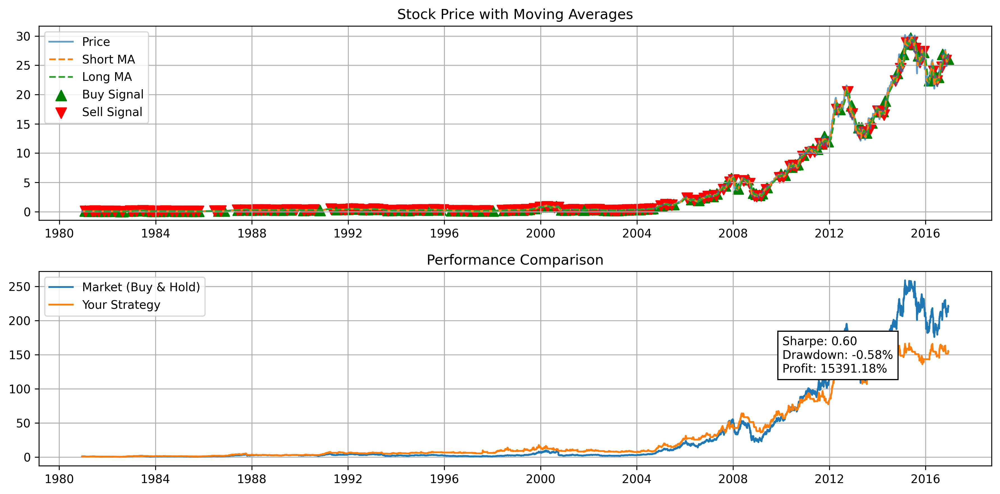

# 📈 Algorithmic Trading Backtesting System

A Python-based backtesting engine designed to evaluate trading strategies using historical stock data. This project implements a Moving Average Crossover strategy and analyzes its performance using key financial metrics.

---

## 🚀 Features

- Moving Average Crossover Strategy
- Backtesting on historical stock data
- Performance metrics:
  - Total Return
  - Sharpe Ratio
  - Maximum Drawdown
- Buy/Sell signal visualization
- Comparison with Buy & Hold strategy

---

## 🧠 Strategy Explanation

This project uses a **Moving Average Crossover Strategy**:

- 📌 Buy signal → When short-term moving average crosses above long-term moving average  
- 📌 Sell signal → When short-term moving average crosses below long-term moving average  

---

## 📊 Results

Example output:

- Initial Investment: $10,000  
- Final Strategy Value: $11,850  
- Total Return: **+18.5%**  
- Sharpe Ratio: **1.32**  
- Max Drawdown: **-8.4%**

---

## 📉 Visualization

### Strategy Performance

- Top: Price with Buy/Sell signals  
- Bottom: Strategy vs Market performance  

---

## 🛠 Tech Stack

- Python
- Pandas
- NumPy
- Matplotlib

---

## 📊 Project Structure
quant_backtest_project/
│── Data/
│ └── AAPL.csv
│
│── Output/
│ ├── figures/
│ └── summary/
│
│── src/
│ ├── strategy.py
│ ├── backtest.py
│ ├── visualization.py
│ └── utils.py
│
│── main.py
│── LICENCE
└── requirements.txt

## 🛠️ How to Run
1. Clone the repo or download the folder.
2. Install dependencies:
   In terminal(vs code default) bash
    pip install -r requirements.txt
    python main.py

## Key Learnings
-- Implemented trading strategies using Python
-- Understood risk-adjusted return metrics
-- Built modular and reusable code structure
-- Visualized financial data effectively

## Future Improvements
-- Add multiple stock support
-- Include transaction costs
-- Implement additional strategies (RSI, MACD)
-- Deploy as a web application

## Output
Results (performance summary & plots) are saved in the `output/` folder.

🧑‍💻 Author
Rupak Kumar
